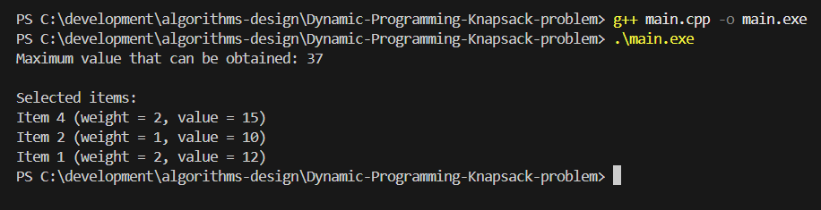

# Dynamic-Programming-Knapsack-problem
Knapsack-problem

## 1. Overview 
The 0/1 Knapsack problem is a classic optimizaation problem in algorithm design. The objective is to determin the maximum value that can be obtained by selecting items to place in a knspsack without exceeding it's weight capacity. 

This project implements the dynamic programming solution to the 0/1 Knapsack problem using a bottom-up tabulation approach. The lagorithm builds a table that stores the maximum value obtainable for each number of items and possible weight cpacities. 


## 2. Problem Description 
Given a set of items, each item has a weight and a value/profit. 

We are given a knapsack with a maximum capacity. 

The objective is to determine the subset of items that does not exceed the knapsack capacity and maximizes the total value. 

Each item can either be included included(1) or excluded(0) from the knapsack. Therefore, this is known as the 0/1 Knapsack problem. 


## 3. Objectives 
The objective of this project are:
* understand the 0/1 knapsack optimization problem
* implement the dynamic progeramming solution
* construct and fill a DP table
* reconstruct the selected items that procuce the optimal value
* analyze time and space complexity of the algorithm


## 4. Input and Output 
#### Input
The program uses a hardcoded set of items defined as: {weight, value}
###### Example:
{2, 12}, {1, 10}, {3, 20}, {2, 15}

Knapsack capacity: 5
#### Output
The program outputs the maximum value obtained and teh items selected to achieve that value.


## 5. Algorithm / Approach 
The algorithm uses bottom-up dynamic programming. 
* Step 1: Create the DP table
  * A table m[i][w] is constructed where M[i][w] = maximum value obtainable using the first i items with capacity w
* Step 2: Base Case
  * If we have 0 items, teh maximum value is 0 regardless of capacity
* Step 3: Fill the DP table
  * for each item and capacity:
  If the item is too heavy: M[i][w] = M[i-1][w]
  Otherwise we choose the better option:
  M[i][w] = max(
            M[i-1][w],
            value_i + M[i-1][w - weight_i]
          )
This compares excluding or including the item
* Step 4: Final solution
The optimal solution is stored in:  M[n][capacity]


## 6. Time and Space Complexity 
Let:
* n = number of items
* W = knspsack capacity

#### Time complexity: O(nW)
#### Space Complexity: O(nW)


## 8. How to Compile and Run 
#### Compile:
```bash
g++ main.cpp -o main
```
#### Run:
```bash
./main.exe
```


## 9. Sample Input and Output 



## 10. Challenges Faced 
One of the main challenges was understanding how the dynamic programming table represents subproblems. Each cell in teh table represents the optimal value that can be achieved using a subset of items and a specific capacity. 

Another challenge was reconstructing the selected items after computing the DP table. This required tracing backwards through the table to determine which items were included in the optimal solution. 

Understanding how the recurrence relation translates into the code implementation was also important for correctly building the DP table. 
